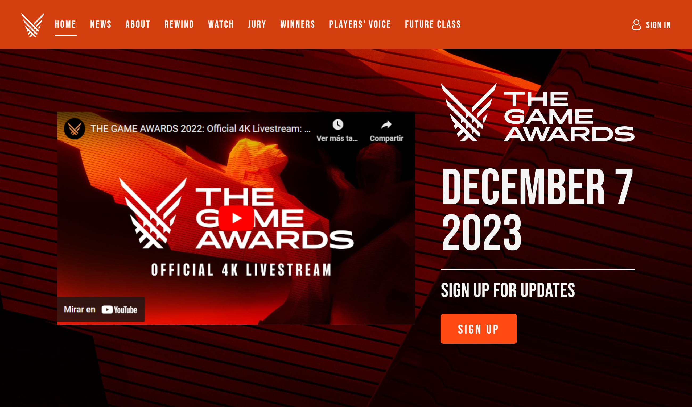
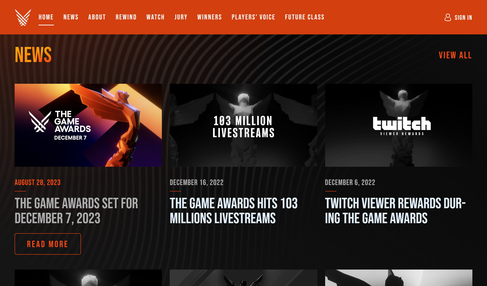
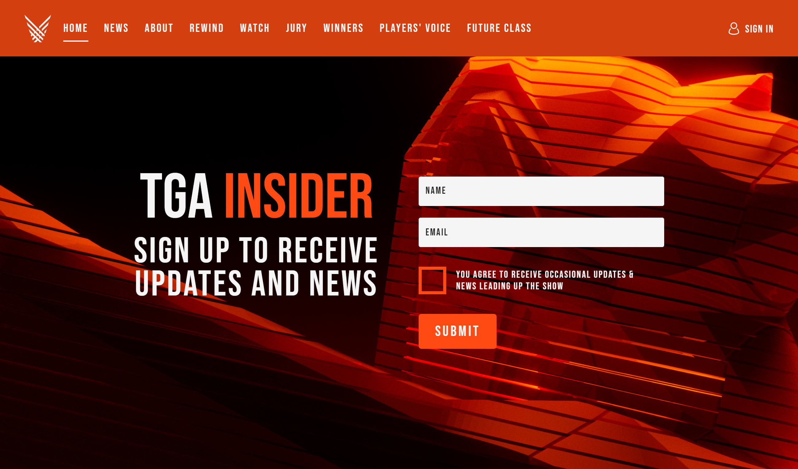
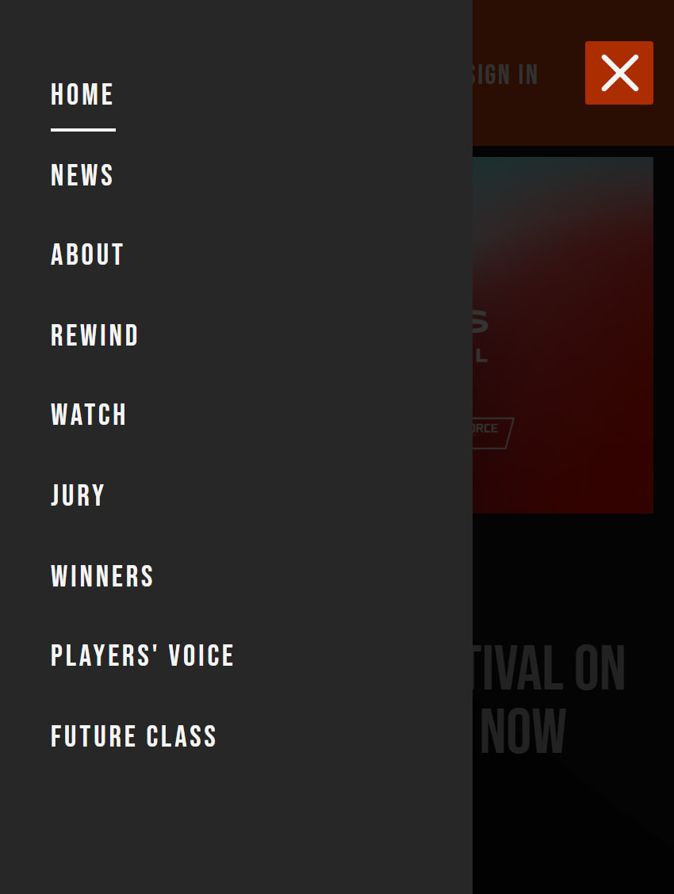

# The Game Awards home page clone solution

### Desktop view

- Intro section



- News Section



- Form Section



### Mobile view




## Link

- [Clon live site](https://clone-tga-home-56d921.netlify.app/)

- [Official Website](https://thegameawards.com/)

## Built with

<p>
 <a href="https://www.typescriptlang.org/">
  
 </a>
  <a href="https://sass-lang.com/">
  
 </a>
  <a href="https://react.dev/blog/2023/03/16/introducing-react-dev">
  
 </a>
  <a href="https://vitejs.dev/">
  
 </a>
</p>

## Run the project locally

1. Clone this repository

2. Install dependencies

  ```sh
   npm install
   ```

3. Start the local server

  ```sh
   npm run dev
   ```
